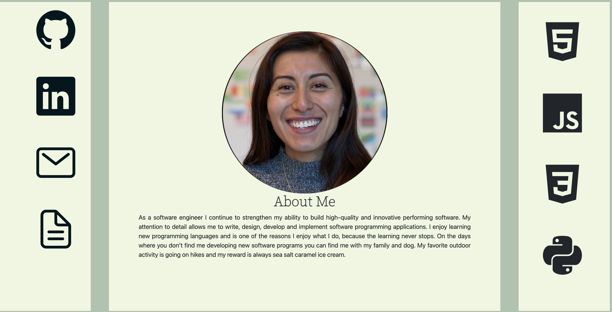

<h1>Haydee Scarlette Ramirez's Portfolio</h1>
Allowing all users to have access to my portfolio wherever they go.
<a href="https://hsrportfolio.netlify.app/">Get to know me!</a>

</img>

My Planning Board
<a href="https://trello.com/b/qx4YJuYk/haydee-ramirez-portfolio">Take a peek.</a>

<h2>Technologies Used</h2>
<ul>
  <li>CSS</li>
  <li>JavaScript</li>
  <li>HTML</li>
  <li>Git</li>
</ul>

<h2>Credit!</h2>
<ul>
  <li>Favicon from iconseight</li>
  <li>Bootstrap for nav bar and card contaier</li>
  <li>google fonts for the awesome fonts</li>
  <li>GA lecture notes and videos</li>
  <li>MDN as a general reference</li>
</ul>

<h2>Next Steps</h2>
<ul>
  <li>Be able to fade image and move "about me" up in place of where the image was located</li>
  <li>Have projects slide clockwise like a slideshow</li>
  <li>have nav bar</li>
  <li>be more mobile friendly</li>
</ul>

